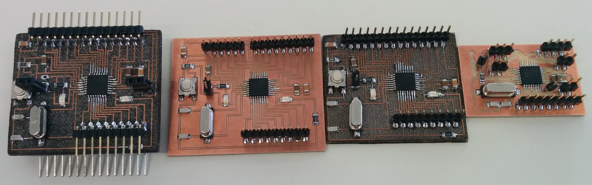

<h1 style="font-family: courier;" align="center">satshakit multicore</h1>

<i>An improved & fabbable 100% Arduino IDE/libraries compatible board.</i>

  

What is satshakit?
--

satshakit is a **100% Arduino IDE  and libraries compatible**, fabbable and open source board, and also an improved version of [Fabkit](http://fabacademy.org/archives/2015/doc/projects/fabkit-0.4.html). 

Main **improvements and features** over Fabkit are:

- **16Mhz** instead of 8Mhz
- **crystal** instead of resonator
- **costs less** (7-9 euro vs 13 euro)
- 100% compatible with **default Arduino IDE** (satshakit is recognized as Arduino UNO)
- ADC6/7 connected instead of ADC6/7 not connected (satshakit laser and cnc)
- larger space to easy soldering (satshakit laser and cnc)

satshakit boards
--

There are different kinds of **satshakit boards** depending on the **fabrication technique** you will use to make them, or on the **size** of the board. 

Here is a comparison table about different satshakit boards:

|name|mcu|pins|size(mm)|
| :---: | :---:|:---:|:---:|
|`satshakit laser`|ATmega328P|Arduino + ADC6/7|48 x 42|
|`satshakit cnc`|ATmega328P| Arduino + ADC6/7  |54 x 45|
|`satshakit multicore`|2 x ATmega328P| 2 x Arduino + ADC6/7|50 x 42|
|`satshakit micro`| ATmega328P|Arduino|40 x 24|
|`satshakit flight controller`| ATmega328P|MultiWii|48 x 48|

Here you can find all of the satshakit boards: **[satshakit organization](https://github.com/satshakit)**.

satshakit multicore
--

**satshakit multicore** boards born as a further experiment on **MCU multithreading and networking**. satshakit multicore boards have only the following modifications in confront of the standard satshakit: 4 extra pin headers (1 GND,1 VCC,1 A4, 1 A5). These pin headers serve also a structural pillars to build a modular satshakit tower. So modular satshakit share the same power source, and can direct communicate with **I2C**. 

Here is the **satshakit multicore board**:

**downloads (right click, download as)**

- [satshakit multicore svg](https://raw.githubusercontent.com/satshakit/satshakit-multicore/master/media/satshakit_multicore/satshakit_multicore.svg)
- [satshakit multicore schematic](https://raw.githubusercontent.com/satshakit/satshakit-multicore/master/eagle_projects/satshakit_multicore/satshakit_multicore.sch)
- [satshakit multicore board](https://raw.githubusercontent.com/satshakit/satshakit-multicore/master/eagle_projects/satshakit_multicore/satshakit_multicore.brd)
- [satshakit multicore BOM Open Document](https://github.com/satshakit/satshakit-multicore/raw/master/docs/satshakit_BOM.ods)
- [satshakit multicore BOM Excel](https://github.com/satshakit/satshakit-multicore/raw/master/docs/satshakit_BOM.xlsx)

**media**

5-core satshakit system:

satshakit multicore assembly & test:

satshakit multicore blink:

quad satshakit bluetooth triangulation:

Getting Started
--
A satshakit board is **totally like an Arduino board**, thus is possible to use the Arduino IDE without any modification. When you finish solder satshakit, you're ready to program it. If you want to use satshakit as an Arduino, you first need to **upload Arduino bootloader**. This will also set the ATmega328P fuses as the same of an Arduino UNO.
 To do this you need to use a **programmer**, for example another Arduino or FabISP. If you plan to program a satshakit with an Arduino, be sure to upload the **Arduino as ISP skecth** before connecting the satshakit to it.

Here are the connection schemas to program **satshakit laser**, **satshakit cnc** or a **satshakit multicore** with an Arduino as ISP or with a FabISP:

Once everything is connected, follow these steps to upload Arduino bootloader:

1. open Arduino IDE 
2. select proper programmer (for example Arduino as ISP or USBtinyISP) 
3. select Arduino UNO as board
4. click on tools->Burn Bootloader

With satshakit multicore, you can use an **FTDI USB cable to upload and use you favourite sketch** without the need to use a programmer anymore.

Here is the connection schema to program a satshakit multicore using the FTDI cable:

Remember that if you don't have an FTDI cable you always need a programmer, and to select **File->Upload using a programmer** to upload the code to satshakit.

To use a satshakit like an Arduino, here is the Arduino pinout on satshakit multicore:

What's in the repo
--
- **[docs](https://github.com/satshakit/satshakit-multicore/tree/master/docs)**: BOM files for Farnell
- **[egle projects](https://github.com/satshakit/satshakit-multicore/tree/master/eagle_projects)**: eagle projects of satshakit
- **[media](https://github.com/satshakit/satshakit-multicore/tree/master/media)**: svg of satshakits, connections schemas, images for cnc milling machine and fiber laser cutter, other images

Authors
--

- Daniele Ingrassia and [Engineering Ingegneria Informatica](http://www.eng.it)

Contact
--
- **ingrassiada@gmail.com**
- **[linkedin](http://it.linkedin.com/in/danieleingrassia)**

Thanks
--

[Fablab opendot](http://www.opendotlab.it/) 
info@opendotlab.it 
Via Tertulliano N70, 20137, Milan, Italy 
 +39.02.36519890 

License
--
This work is licensed under the terms of Attribution-NonCommercial-ShareAlike 4.0 International ([CC BY-NC-SA 4.0](https://creativecommons.org/licenses/by-nc-sa/4.0/)).

Disclaimer  
--

This hardware/software is provided "as is", and you use the hardware/software at your own risk. Under no circumstances shall any author be liable for direct, indirect, special, incidental, or consequential damages resulting from the use, misuse, or inability to use this hardware/software, even if the authors have been advised of the possibility of such damages.

